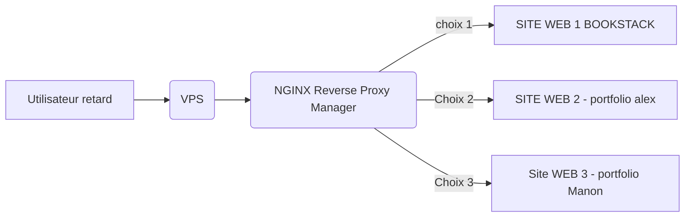

# Job_PJ
Description de la mort qui tue de fou malade zerma t'y a jamais vue aussi nul que ca de t'as vie 
le type a perdu du temps pour une description qui ne vas jamais etre lue par personne d'ailleur j'ai des probleme de ......

## Schemat

## TUTO INSTALLATION
- avoir un ordi
- avoir allumer l'ordi
- etre connecter a internet

## Installation Complete
- chmod +x script.sh
- ./script.sh

## pour lancer le container nginx_proxy_manager
sudo docker-compose -f nginx_proxy_manager?.yml -p nginx up -d
